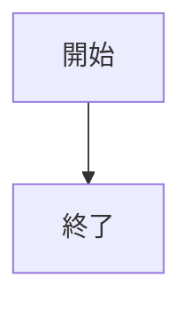

<!-- cspell:ignore println -->
<!-- markdownlint-disable MD033 -->
<div class="cover">
  <div class="title">ドキュメントテンプレート</div>
  <div class="version">v1.0.0</div>
  <div class="date">yyyy-MM-dd</div>
  <div class="logo">

   

  </div>
  <div class="copyrights">©2024 dummy All rights reserved.</div>
</div>
<!-- markdownlint-enable MD033 -->

<!-- omit from toc -->
# 目次

- [1. ドキュメントの全体設定](#1-ドキュメントの全体設定)
    - [1.1. タイトルの設定](#11-タイトルの設定)
    - [1.2. ドキュメントバージョンの設定](#12-ドキュメントバージョンの設定)
    - [1.3. 発行日の設定](#13-発行日の設定)
    - [1.4. ロゴの差し替え](#14-ロゴの差し替え)
    - [1.5. コピーライトの設定](#15-コピーライトの設定)
    - [1.6. PDF 出力先の設定](#16-pdf-出力先の設定)
    - [1.7. 目次の作成](#17-目次の作成)
- [2. 簡単な構文の例](#2-簡単な構文の例)
    - [2.1. 通常の本文](#21-通常の本文)
    - [2.2. 段落](#22-段落)
    - [2.3. 強調](#23-強調)
    - [2.4. 取り消し線](#24-取り消し線)
    - [2.5. 見出し](#25-見出し)
        - [2.5.1. 見出しレベル 3 のサンプル](#251-見出しレベル-3-のサンプル)
    - [2.6. コードブロック](#26-コードブロック)
    - [2.7. インラインコード](#27-インラインコード)
    - [2.8. リンク](#28-リンク)
    - [2.9. 画像](#29-画像)
    - [2.10. テーブル](#210-テーブル)
    - [2.11. 箇条書き](#211-箇条書き)
    - [2.12. タスクリスト](#212-タスクリスト)
    - [2.13. 番号付きリスト](#213-番号付きリスト)
    - [2.14. 引用](#214-引用)
    - [2.15. 水平線](#215-水平線)
    - [2.16. エスケープ](#216-エスケープ)
    - [2.17. アラート](#217-アラート)
- [3. 参考資料](#3-参考資料)

# 1. ドキュメントの全体設定

## 1.1. タイトルの設定

Markdown ファイルの先頭に付与されている `document_title` 属性にドキュメントのタイトルを設定してください。
出力する PDF のヘッダー部分にドキュメントタイトルが印刷されます。

ヘッダーの後に続くのは表紙の設定です。
`<div class="title">ドキュメントテンプレート</div>` の部分を置き換えてください。

## 1.2. ドキュメントバージョンの設定

表紙にドキュメントバージョンの表示領域を確保してあります。
`<div class="version">v1.0.0</div>` の部分を置き換えてください。

## 1.3. 発行日の設定

表紙に発行日の表示領域を確保してあります。
`<div class="date">yyyy-MM-dd</div>` の部分を置き換えてください。

## 1.4. ロゴの差し替え

ドキュメントの表紙には、著者の所属会社や、コミュニティー、著者自身のロゴを表示する領域が用意してあります。
ロゴファイルは /docs/_shared-images/logo.svg を利用するように構成してあります。
このダミー画像の差し替えか、 `` の部分を別のロゴ画像パスに置き換えてください。

## 1.5. コピーライトの設定

表紙にコピーライトの表示領域を確保してあります。
`<div class="copyrights">©2024 dummy All rights reserved.</div>` の部分を置き換えてください。

## 1.6. PDF 出力先の設定

Markdown ファイルの先頭に付与されている `dest` 属性に、 PDF 化したファイルの出力パスを設定してください。
ビルドパイプラインを既定値のまま利用する場合、 \.\/output フォルダー以下のパスを指定してください。
なお `dest` 属性に指定したフォルダーが存在しない状態で PDF 化スクリプトを実行するとエラーになります。

## 1.7. 目次の作成

表紙の次のページに目次ページを配置することを推奨します。
ドキュメントテンプレートにも、目次ページが入るよう構成してあります。

目次ページには、見出しレベル 1 の「目次」という見出しをつけるようにしてください。
これを変更したい場合は、 \/docs\/base-style.css の修正が必要です。

# 2. 簡単な構文の例

よく利用する構文について例示します。
その他の構文については以下をご覧ください。

- <https://github.github.com/gfm/>

## 2.1. 通常の本文

本文は 1 文につき 1 行にしてください。
マークダウン上の改行は PDF 化の時無視されます。

## 2.2. 段落

空行を入れるとその部分で段落が分割されます。

```md
最初の文。
次の文。

段落分割後の文。
```

これは次のようにレンダリングされます。

最初の文。
次の文。

段落分割後の文。

## 2.3. 強調

`**` で文字列を囲うと、太字にできます。

```md
明日は**9 時集合**です。
```

これは次のようにレンダリングされます。

明日は**9 時集合**です。

## 2.4. 取り消し線

チルダ 2 つで囲うと、取り消し線を引けます。

```md
会議室は ~~705~~ 805 です。
```

これは次のようにレンダリングされます。

会議室は ~~705~~ 805 です。

## 2.5. 見出し

「#」を並べると、見出しを作成できます。

```md
# 見出しレベル 1
## 見出しレベル 2
### 見出しレベル 3
```

Markdown All in One の機能を利用して目次を作成する場合、見出しレベル 3 までが表示されるよう設定してあります。

### 2.5.1. 見出しレベル 3 のサンプル

見出しレベル 3 の本文。

#### 見出しレベル 4 のサンプル

見出しレベル 4 の本文。

## 2.6. コードブロック

コードブロックはバッククォート 3 つで囲ってください。
バッククォートの前後は空行にします。
最初のバッククォートの後ろに言語名を指定することで、きれいなシンタックスハイライトが使えます。

Java の例。

```java
public class Main {
    public static void main(String[] args) {
        System.out.println("Hello, World!");
    }
}
```

C# の例。

```csharp
using System;

class Program
{
    static void Main(int[] args)
    {
        Console.WriteLine("Hello, World!");
    }
}
```

## 2.7. インラインコード

コードをインラインで表示する場合はバッククォートで囲ってください。

```md
このようにコード `inline code` を行内に埋め込めます。
```

これは次のようにレンダリングされます。

このようにコード `inline code` を行内に埋め込めます。

## 2.8. リンク

リンク付きの文字列は次のようにしてください。

```md
[リンクの例](https://github.com/tsuna-can-se/md2pdf-doc-template)
```

これは次のようにレンダリングされます。

[リンクの例](https://github.com/tsuna-can-se/md2pdf-doc-template)

URL を `< >` で囲うと、そのままリンクにできます。

```md
<https://github.com/tsuna-can-se/md2pdf-doc-template>
```

これは次のようにレンダリングされます。

<https://github.com/tsuna-can-se/md2pdf-doc-template>

## 2.9. 画像

画像は draw.io で作成した SVG 画像を使用してください。
\*.drawio ファイルと、作成した \*.svg ファイルを images フォルダーに配置します。
画像内に文字を入れる場合は、フォントを `Yu Gothic UI` に、フォントサイズを 16 ポイントに設定してください。

画像の挿入は次のようにします。

```md

```

これは次のようにレンダリングされます。


簡単な図は、 [mermaid](https://mermaid.js.org/) で作成できます ( Beta )。
` ```mermaid ～ ``` ` で囲った範囲に mermaid 記法で図を記述できます。
図は次のようにレンダリングできます。



## 2.10. テーブル

テーブルは以下のようにしてください。
区切り線の左右に `:` を入れると、左寄せ / 右寄せ / 中央寄せを設定できます。

```md
| ヘッダー 1 | ヘッダー 2 | ヘッダー 3 |
| ---------- | ---------: | :--------: |
| 左寄せ     |     右寄せ |  中央寄せ  |
| 内容 1     |     内容 2 |   内容 3   |
```

これは次のようにレンダリングされます。

| ヘッダー 1 | ヘッダー 2 | ヘッダー 3 |
| ---------- | ---------: | :--------: |
| 左寄せ     |     右寄せ |  中央寄せ  |
| 内容 1     |     内容 2 |   内容 3   |

セル内改行はできません。
セル内に文を書きたい場合は、テーブルではない別の表現方法を検討してください。

## 2.11. 箇条書き

`-` で作成してください。
半角空白文字を 4 つ入れると、階層構造が作れます。

```md
- 箇条書き 1
- 箇条書き 2
    - 箇条書き 2-1
    - 箇条書き 2-2

      箇条書きの下に文章を追加する場合は、空行を入れてから、半角空白文字を行頭に入れてインデントをそろえます。
      複数文を入れることもできますが、 PDF 化すると 1 行にまとめられます。

- 箇条書き 3
```

これは次のようにレンダリングされます。

- 箇条書き 1
- 箇条書き 2
    - 箇条書き 2-1
    - 箇条書き 2-2

      箇条書きの下に文章を追加する場合は、空行を入れてから、半角空白文字を行頭に入れてインデントをそろえます。
      複数文を入れることもできますが、 PDF 化すると 1 行にまとめられます。

- 箇条書き 3

## 2.12. タスクリスト

チェックボックスを先頭に持つリストをタスクリストと呼びます。
チェックボックスのオン / オフを設定できます。

```md
- [ ] タスク 1
    - [x] タスク 1-1
    - [ ] タスク 1-2
- [x] タスク 2
```

これは次のようにレンダリングされます。

- [ ] タスク 1
    - [x] タスク 1-1
    - [ ] タスク 1-2
- [x] タスク 2

## 2.13. 番号付きリスト

`1.` で作成してください。
半角空白文字を 4 つ入れると、階層構造が作れます。

```md
1. 番号付きリスト 1
1. 番号付きリスト 2
    1. 番号付きリスト 2-1
    1. 番号付きリスト 2-2

       番号付きリストの下に文章を追加する場合は、空行を入れてから、半角空白文字を行頭に入れてインデントをそろえます。
       複数文を入れることもできますが、 PDF 化すると 1 行にまとめられます。

1. 番号付きリスト 3
```

これは次のようにレンダリングされます。

1. 番号付きリスト 1
1. 番号付きリスト 2
    1. 番号付きリスト 2-1
    1. 番号付きリスト 2-2

       番号付きリストの下に文章を追加する場合は、空行を入れてから、半角空白文字を行頭に入れてインデントをそろえます。
       複数文を入れることもできますが、 PDF 化すると 1 行にまとめられます。

1. 番号付きリスト 3

## 2.14. 引用

引用は `>` で作成してください。

```md
> 引用の例です。
> 引用の中には、箇条書きなど別の要素を入れることができます。
>
> - 箇条書き 1
> - 箇条書き 2
```

これは次のようにレンダリングされます。

> 引用の例です。
> 引用の中には、箇条書きなど別の要素を入れることができます。
>
> - 箇条書き 1
> - 箇条書き 2

## 2.15. 水平線

水平線を引く場合は `***` を利用します。

```md
***
```

これは次のようにレンダリングされます。

***

## 2.16. エスケープ

半角句読点の文字は、 `\` でエスケープできます。

```md
\# \" \| \( \) \. \"
```

これは次のようにレンダリングされます。

\# \" \| \( \) \. \"

## 2.17. アラート

コンテンツの重要な部分を目立たせるために、本文内に囲み記事（アラート）を作成できます。
アラートは、以下の構文で作成します。

```md
!!! <アラートの種類> <タイトル>
アラートの本文。
!!!
```

アラートの種類は、次から選択します。
アラートの種類に応じて、配色とアイコンが変わります。

<!-- textlint-disable ja-technical-writing/sentence-length -->
<!-- markdownlint-disable-next-line MD013 -->
`abstract` / `attention` / `bug` / `caution` / `danger` / `error` / `example` / `failure` / `hint` / `info` / `note` / `question` / `quote` / `success` / `tip` / `warning`
<!-- textlint-enable ja-technical-writing/sentence-length -->

<!-- コードブロックの記述例を示すため、チルダでコードブロックを記述 -->
<!-- markdownlint-disable-next-line MD048 -->
~~~md
!!! tip アラートの例
アラートの種類に応じて配色が変わります。
アラートの種類に前述の文字列を指定しないと、正しく表示されません。
`!!!` で囲った範囲には、複数の行を配置できます。

空行を設けると、本文と同様に改行できます。
コードブロックも配置できます。

```java
System.out.println("Hello, World!");
```

画像の配置や `mermaid` の利用もできます。


!!!
~~~

これは次のようにレンダリングされます。

!!! tip アラートの例
アラートの種類に応じて配色が変わります。
アラートの種類に前述の文字列を指定しないと、正しく表示されません。
`!!!` で囲った範囲には、複数の行を配置できます。

空行を設けると、本文と同様に改行できます。
コードブロックも配置できます。

```java
System.out.println("Hello, World!");
```

画像の配置や `mermaid` の利用もできます。


!!!

アラートの種類ごとの配色およびアイコンの例は、次のとおりです。

!!! abstract abstract
abstract の内容。
!!!

!!! attention attention
attention の内容。
!!!

!!! bug bug
bug の内容。
!!!

!!! caution caution
caution の内容。
!!!

!!! danger danger
danger の内容。
!!!

!!! error error
error の内容。
!!!

!!! example example
example の内容。
!!!

!!! failure failure
failure の内容。
!!!

!!! hint hint
hint の内容。
!!!

!!! info info
info の内容。
!!!

!!! note note
note の内容。
!!!

!!! question question
question の内容。
!!!

!!! quote quote
quote の内容。
!!!

!!! success success
success の内容。
!!!

!!! tip tip
tip の内容。
!!!

!!! warning warning
warning の内容。
!!!

# 3. 参考資料

詳細な構文については、以下をご覧ください。

<https://github.github.com/gfm/>
